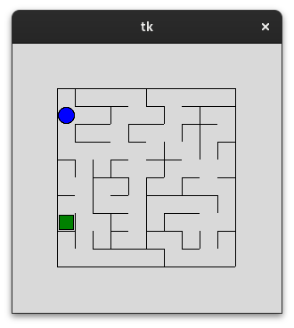
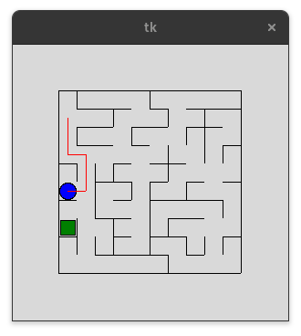
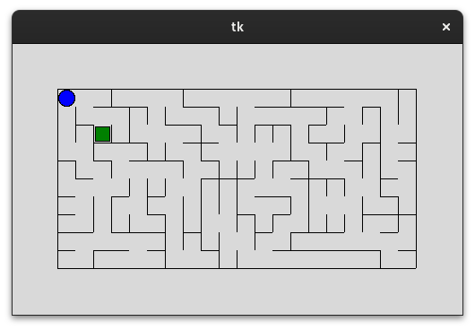

# Table of Contents

1.  [Installation](#org655f800)
2.  [Basic Usage](#org7686fb6)
    1.  [Moving around the maze](#org7b7846a)
    2.  [Escaping the maze](#org5c4ab5b)
    3.  [Leaving a trace](#org6434377)
3.  [Advanced Usage](#orgfa2d53d)
    1.  [Changing Maze size](#orge2dc0ab)
    2.  [Deterministic Random Maze Creation](#orga80957c)
4.  [Technical details](#org300aa45)

Teach your robot how to escape the maze!

This is a simple game library with no other dependencies than modern python.

The aim of this library is to allow people experiment with python

# Installation

    pip install git+https://github.com/noiseOnTheNet/maze_robot.git

# Basic Usage

Launch a command python command line then type the following

    # imports the robot object and 4 directions
    from maze_robot import Robot, N, S, E, W
    # create a new robot instance
    r = Robot()
    # shows the maze
    r.view()

A tk window with a 10x10 random maze appears: the maze is all connected.

The robot is represented by a circle while the exit is represented by a square

Coordinates start from 0,0 in the top left corner and grow moving right (x coordinate) or down (y coordinate)

The robot will always start at 0,0 while the exit is put randomly somewhere

In case you want to launch it within an ipython shell please execute the
following command in advance:

    %gui tk

## Moving around the maze

You can move around your robot by using the move method, passing one direction (N, S, W, E)
enumeration object

    r.move(N)

if there is no wall in that direction the operation succeeds returning a true
value, otherwise a false value is returned

The robot has a &ldquo;geolocation&rdquo; functionality: it knows where it is in the grid.
To get its position you can look at the &ldquo;position&rdquo; read-only attribute

    r.position
    # it returns a tuple of integers e.g. (1, 2)

## Escaping the maze

You can guide the robot to the exit by moving it around until you reach the exit.
The exit is sensed by the robot using the exit method

    r.exit()

this method returns true if the robot is in the same grid cell as the exit.

But this is not the funniest way to use the robot: I think the funniest way is
to see the robot find the exit by itself.

While you can see the whole maze, the robot does not. It just see the walls
around its position.

    r.walls
    # returns a tuple of directions where walls are e.g.(N, W, S)

## Leaving a trace

If you want to see where your robot moves you can leave a graphical trace on the
maze floor by using the `down_pen()` method.

    r.down_pen()

Now the robot will leave a red track behind. The robot cannot sense this track
so it is only for you to see

When you want to stop littering the maze you can use `up_pen()`

    r.up_pen()

# Advanced Usage

## Changing Maze size

you can provide your own maze by using the `Maze` class

    from maze_robot.robot import Maze
    maze = Maze.kruskal(cols=20,rows=10)
    r = Robot(maze)
    r.view()

Have fun with larger mazes!

Warning: the current implementation of the maze generation is not the most efficient, larger mazes may be slow to create.

## Deterministic Random Maze Creation

If you want to test your algorithm on a specific maze you can provide a seed
which will generate always the same maze.

    from maze_robot.robot import Maze
    maze = Maze.kruskal(cols=20,rows=10, seed=0)
    r = Robot(maze)
    r.view()

# Technical details

There are interesting algorithms about maze generation here:

<https://en.wikipedia.org/wiki/Maze_generation_algorithm>

This library uses the Kruskal algorithm which has some interesting features so
far but may add more in the future.

